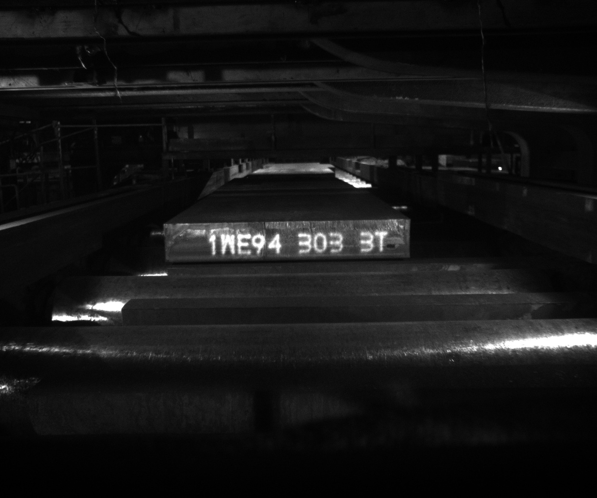
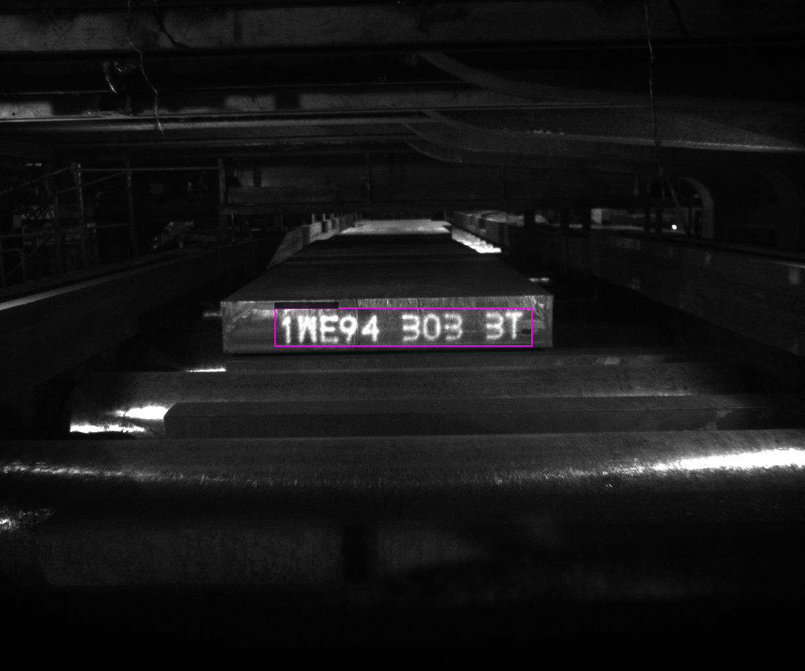
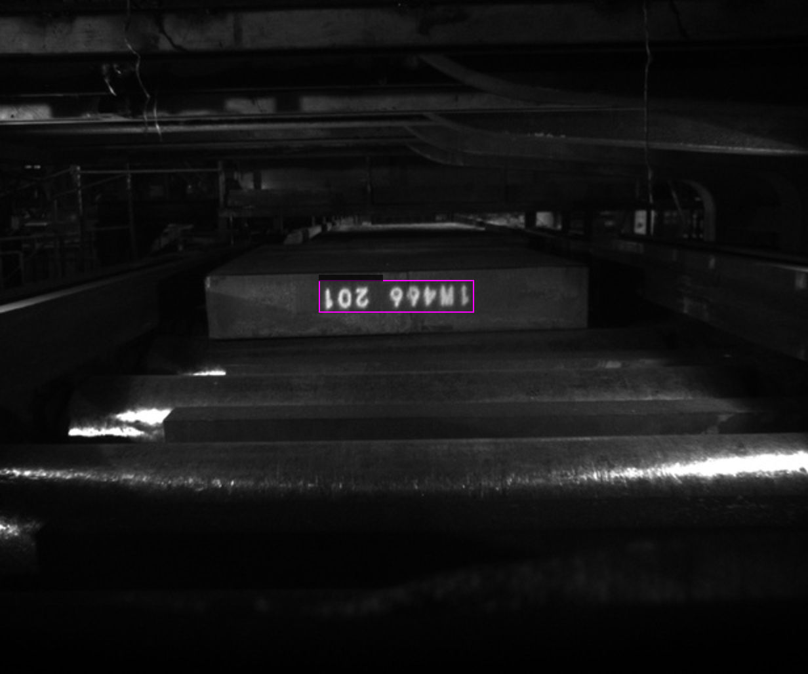
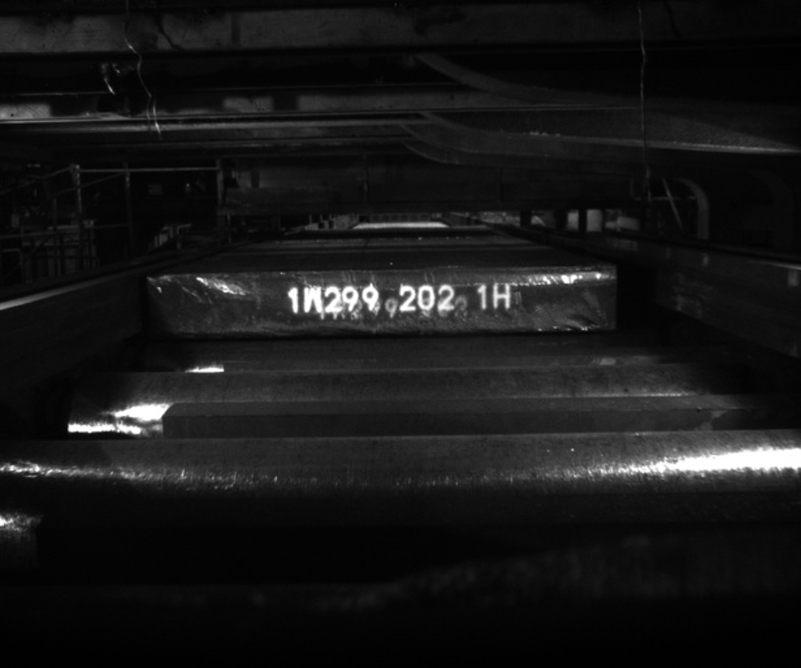
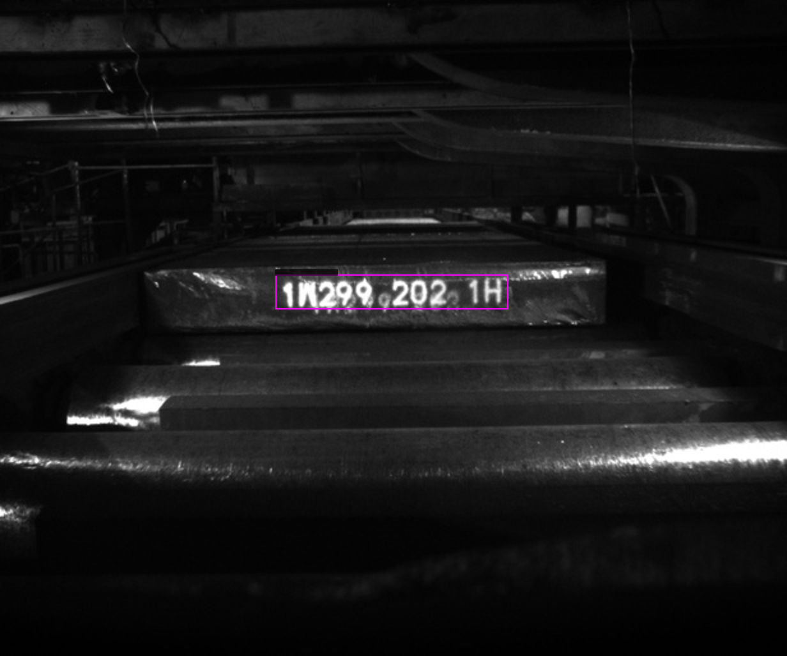
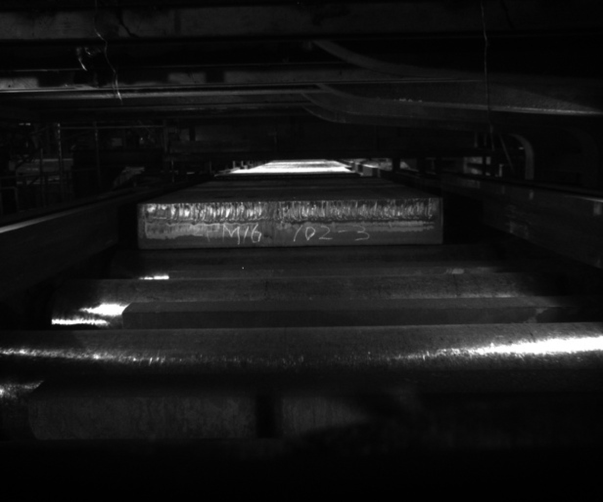
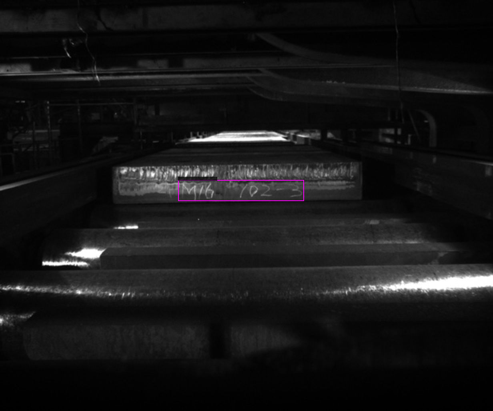
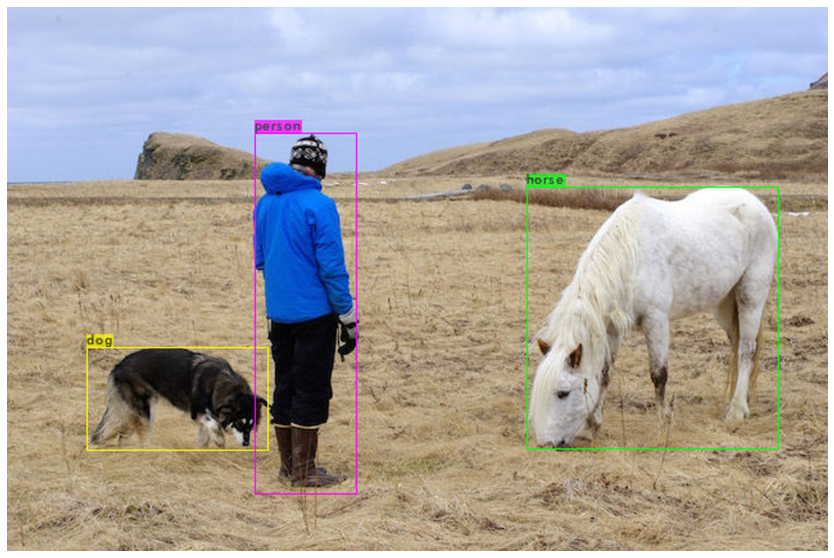
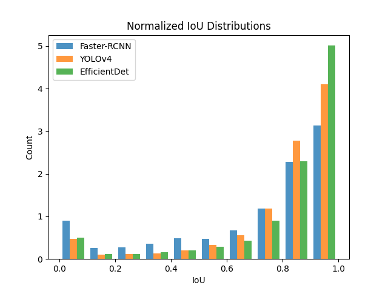

# 2021TBrain-OCR-Challenge [[1]]

## 競賽說明

判別影像中的印刷或手寫序號辨識之建模。除了要能辨識正常印刷之序號（含數字及英文字母），還得針對手寫序號、序號上下顛倒、重複印刷序號、或序號模糊等情況做有效的處理，以發展出適合實際產線運作的序號辨識系統。

## 範例影像

| # | 原始影像 | 物件偵測 | 字元辨識 |
|---|--------------------------|----------------------------|-----------------------------|
| 1 |  |  | 1WE943033T                  |
| 2 |  |  | 1W466201                    |
| 3 |  |  | 1W2992021H                  |
| 4 |  |  | 2PM161023                   |

## 觀察(見範例影像)

1. 影像上的序號長度不一致。
2. 有水平翻轉與垂直翻轉同時發生的影像。
3. 每張影像大小雖相同但序號大小與位置不同。
4. 影像有若干雜訊(手寫字體潦草、序號與無關的字體部分重疊)。

## 建模思維
藉由如上觀察，可知此專案需先對原始影像做物件偵測準確獲取序號位置，再放入模型做字元辨識。

● 物件偵測我們將藉由 finetune 知名的YoLov4 模型 [[2]]、[[3]] 完成，YoLo能框出物件，並標註該物件的類別，如下圖所示，此專案我們僅需要框出物件不需辨識該物件為何。

● 因序號長度不同，我們直接選擇由sequence-to-sequence model來處理字元辨識，在眾多模型之中，我們選用 TrOCR 模型 [[4]]、[[5]]。此模型由微軟亞洲研究院提出，完全不需卷積網路（CNN）做為骨幹，採用新穎的Transformer架構，其中包括用來辨識影像的ViT（Vision Transformer）[[6]] 和用於自然語言處理的BERT預訓練模型，論文中揭示在手寫辨識和影印辨識的效果斐然。我們將用我們的資料集 finetune TrOCR 模型。

## 建模流程 (建模過程均於 Google Colaboratory完成)
| # | 程式碼 | 說明  |
|---|-------|-------|
| 1 | YoLov4.ipynb | 參考darknet [[3]] 寫成，於此finetune YoLov4，因為此專案僅需YoLo框出目標而不在意分類(此專案只有一類，也就是序號需辨識)，模型選擇的技術指標僅考量IoU(Intersection over Union)，此數值介於0~1之間，數值愈大表示框出之範圍愈準確。惟訓練資料提供之品質不佳，遂決定自行標註影像上的序號位置 [[7]]，再投入訓練。最終yolov4-custom_3000.weights的average IoU = 91.32% 優於其餘預訓練模型。 |
| 2 | TrOCR.ipynb | 參考HuggingFace [[5]] 完成，建模的前處理如下： 1. 觀察知道有些影像發生翻轉，故對訓練資料做影像增強(Image Augmentation)。 2. 將影像大小縮放至384x384，以符合ViT model規範 [[5]]、[[6]]。 3. 將縮放後的影像歸一化(Normalization)始進入模型進行訓練。 模型選擇的技術指標不以交叉熵損失函數來度量，而是採用競賽官方提供的評分方式 [[1]]，著重於序號是否能完全預測正確，此指標數值愈小表示序號預測愈準確。最終採用 my-model-epoch54，做為我的TrOCR 模型。 |
| 3 | inference.ipynb | 載入 yolov4-custom_3000.weights 模型，對測試資料框出物件位置，再接著以my-model-epoch54 生成字元辨識，最後將辨識結果寫入excel上傳至競賽官方。 |

## 結語
此次數據競賽最終取得第11名(11/321)，在模型取捨上仍有嘗試進步的空間。
1. 下圖是在FiftyOne 資料集中進行實驗並繪製模型的 IoU 分佈圖
(credit by Eric Hofesmann [[8]])，在此實驗中，Eric Hofesmann表示，EfficientDet [[9]] 的 mAP 低於 YoLov4，但邊界框(bounding boxes) IoU > 0.9 的百分比明顯更高。這表明如果任務中邊界框的緊密度很重要，那麼 EfficientDet 是比 YoLov4 或 Faster-RCNN 更好的選擇。可見EfficientDet在我們的專案是值得嘗試的。

2. 我們在TrOCR的實作中，採用的是TrOCR base model (334M個參數)，論文另有提供TrOCR large model(558M個參數)公開使用，惟當時擁有的硬體效能不足以操作如此龐大的模型。

[//]: # (## Reference)
[1]: https://tbrain.trendmicro.com.tw/Competitions/Details/17
[2]: https://arxiv.org/pdf/2004.10934.pdf
[3]: https://github.com/AlexeyAB/darknet#readme
[4]: https://arxiv.org/pdf/2109.10282.pdf
[5]: https://huggingface.co/docs/transformers/model_doc/trocr
[6]: https://arxiv.org/pdf/2010.11929.pdf
[7]: https://github.com/tzutalin/labelImg
[8]: https://towardsdatascience.com/iou-a-better-detection-evaluation-metric-45a511185be1
[9]: https://arxiv.org/pdf/1911.09070.pdf
